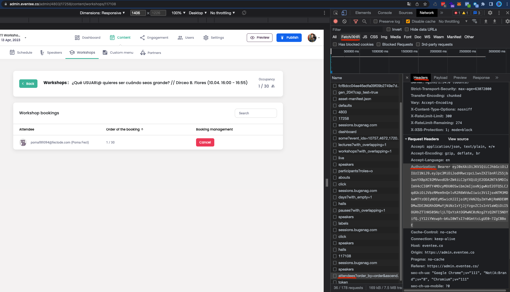

# React + EventeeAPI

Este proyecto fue realizado para obtener la lista de participantes registrados en una conferencia o workshop de un evento creado en Eventee.

## Página

Entra a la demo desde aqui: [React + EventeeAPI](https://awesomeopensource.com/project/elangosundar/awesome-README-templates)

## How to use 🤔

Entra a la sección de Admin de Eventee y selecciona el evento donde estará la conferencia y workshop a exportar.

Entra desde aqui: [Admin Eventee](https://admin.eventee.co/admin/preview)

La página te pedirá dos campos obligatorios para obtener la información completa de la conferencia / workshop. Estos campos se obtendrán de la siguiente manera:

- ID de la Conferencia o Workshop

El ID lo obtendrás en la url de eventee cuando estén dentro del workshop y veas la lista de los registrados. El id será el ultimo número de la url, el que va después de workshops/{id} Ej:

```text
https://admin.eventee.co/admin/4803/17258/content/workshops/117108
ID = 117108
```

- Bearer Token

El token de autenticación lo sacaremos desde los Chrome DevTools, ya que tendremos que sacarlo desde la opción "Network", sigue los siguiente pasos:

1. Inspecciona la página (F12 o botón derecho -> Inspeccionar)
2. Dirigete a la pestaña "Network"
3. Da refresh a la página (F5)
4. En la pestaña, da clic en la opción "Fetch/XHR"
5. Busca en la lista un registro con el nombre "attendees"
6. En la vista derecha, ubicate en "Headers" y busca el que diga "Authorization"
7. Copia todo el hash sin el "Bearer"



Este proceso se hace porque la API Publica de Eventee no nos proporciona este endpoint.

Teniendo ambos campos ya podrás visualizar la información de la conferencia / workshop y descargar en CSV la lista de los participantes registrados